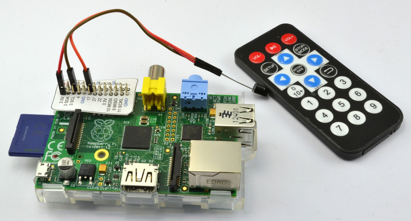
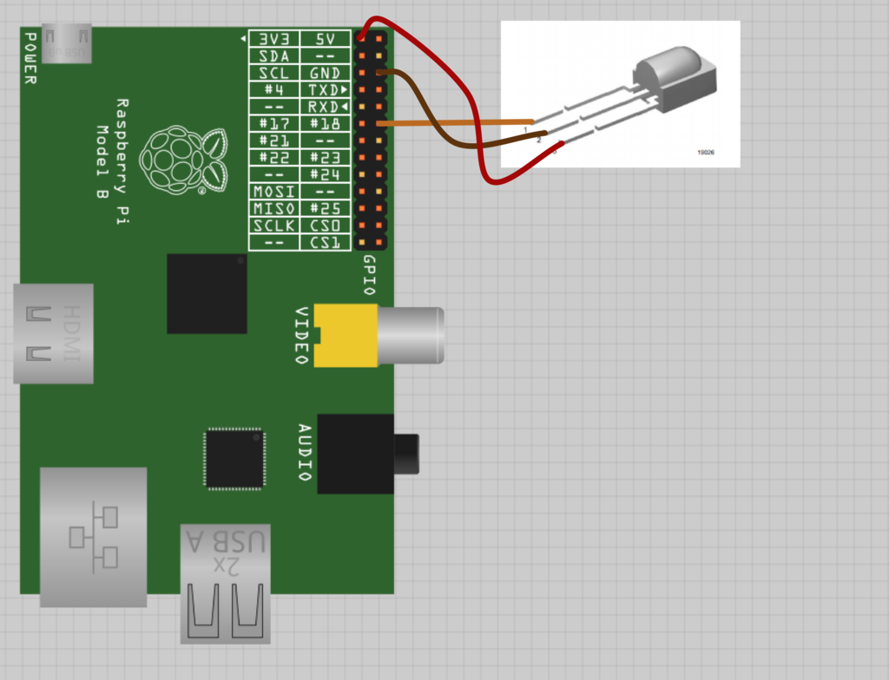
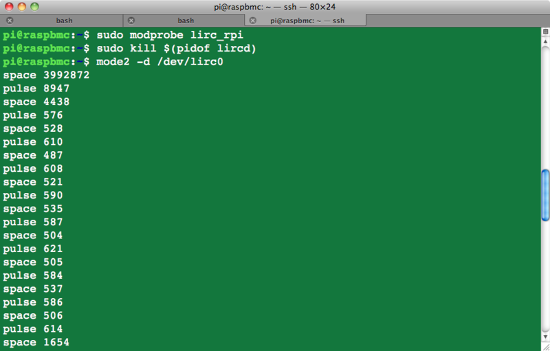

# Raspberry pi GPIO IR receiver

## Parts

A TSOP38238 (I've used a TSOP4838 and works perfectly).

## Hardware

The IR sensor has just three pins, that will connect with three pins on the GPIO connector. To do the connecting, we can use female to female jumper leads. These make a good reliable connection as the IR sensor has unusually thick leads for an IC.

Make the connections as shown below. Note that you do not have to use the same colored jumper wires. But selecting adjacent wires that are still in a 'ribbon' will help keep things neat.

Note that the IR sensor chip needs to be operated at 3.3V not 5V when used with the Raspberry Pi.

## Test the receiver
Now connect to the Raspberry Pi using SSH and issue the commands shown below:

Now hold the remote in front of the receiver and you should see a series of *pulse* / *space* messages appear each time you press a button.
Congratualtions! The IR receiver is working.

## Configure the remote

You can generate a config file for it using the *irrecord* tool. The process is as follows:

* Turn the remote off on XMBC using Rasbmc as we did before using 'mode2'.
* Rename the existing lircd.conf out of the way
Type the command 'irrecord –list-namespace'. This will tell you the allowed key names that you can use when prompted.
* Type the command 'irrecord -d /dev/lirc0 ~/lircd.conf'
* Follow the instructions to the letter. It all seems a bit odd, but the program has to work out the timings and encodings used by the remote.

 
 List of useful key names:
 <pre><code>          KEY_UP
          KEY_VOLUMEDOWN
          KEY_VOLUMEUP
          KEY_PLAY
          KEY_PAUSE
          KEY_REWIND
          KEY_FASTFORWARD
          KEY_STOP
          KEY_LEFT
          KEY_ENTER
          KEY_RIGHT
          KEY_DOWN
          KEY_BACK
          KEY_ESC
          KEY_SETUP
          KEY_MUTE
          KEY_KP0
          KEY_KP1
          KEY_KP2
          KEY_KP3
          KEY_KP4
          KEY_KP5
          KEY_KP6
          KEY_KP7
          KEY_KP8
          KEY_KP9
</code></pre>

A sample of lirc.conf created using a Samsung TV remote could be found [here](lircd.conf).